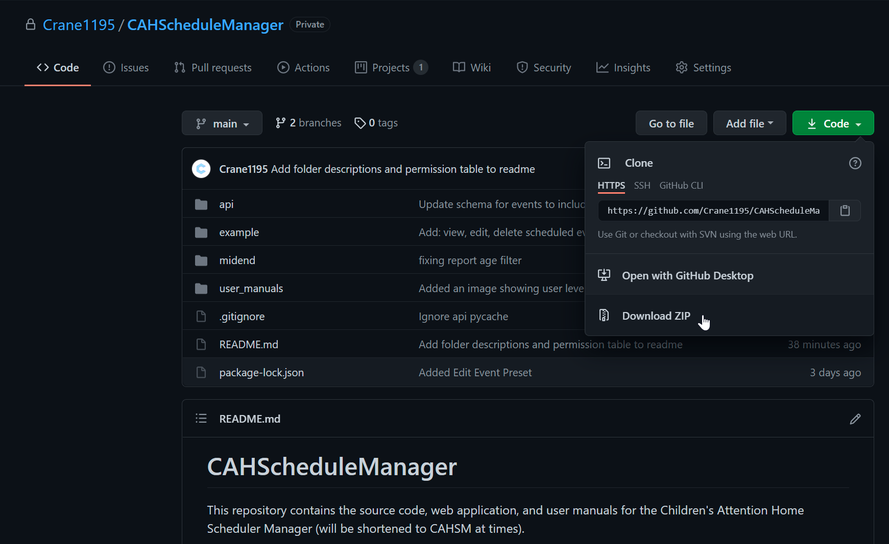

# Windows Deployment Instructions

To run the CAHSM web application on Windows, you will need to:

1. Download this repository as a zip, clone it using Git, or open it using GitHub Desktop. 

2. Install the latest Python3 Windows installer (64-bit) from https://www.python.org/downloads/
    - As of April 9th, 2021, this is https://www.python.org/ftp/python/3.9.4/python-3.9.4-amd64.exe
    - Be sure to add Python to your path during installation

3. Install the latest Node.js LTS Windows Installer from https://nodejs.org/en/download/
    - As of April 9th, 2021, this is https://nodejs.org/dist/v14.16.1/node-v14.16.1-x64.msi
    - Be sure to enable Automatically Install the Necessary Tools during installation

4. Restart your computer to refresh your PATH

5. Open `/api` in a terminal application like **PowerShell** or the Atom IDE package **platformio-ide-terminal**
    - For the first time setup (you only have to do this once)
        - Run `pip install flask`
        - Run `pip install flask_restful`
        - Run `pip install markdown`
    - **To run the database API:**
        - **Run `python run.py`**

6. Open another terminal window in `/example`
    - For the first time setup (you only have to do this once)
        - Run `npm install express`
        - Run `npm install serve-favicon`
        - Run `npm install moment`
        - Run `npm install express-session`
        - Run `npm install node-uuid`
        - Run `npm install xmlhttprequest`
        - Run `npm install chart.js`
        - Run `npm install ejs`
        - If you are modifying and debugging the code
            - Run `npm install nodemon`
    - **To run the web application:**
        - **Run `node app.js` to run the web application normally**
        - **Run `nodemon app.js` if you are modifying and debugging the code**
7. Open a third terminal window in `/deployment`
    - Run `node insert_overseer.js YourUsername YourPassword` to insert the first system overseer account for the system, which can be logged into using the username and password you choose. All future accounts can be created using the web interface.

8. The web app is now running. Enter `localhost:8080` in your web browser to access it.
